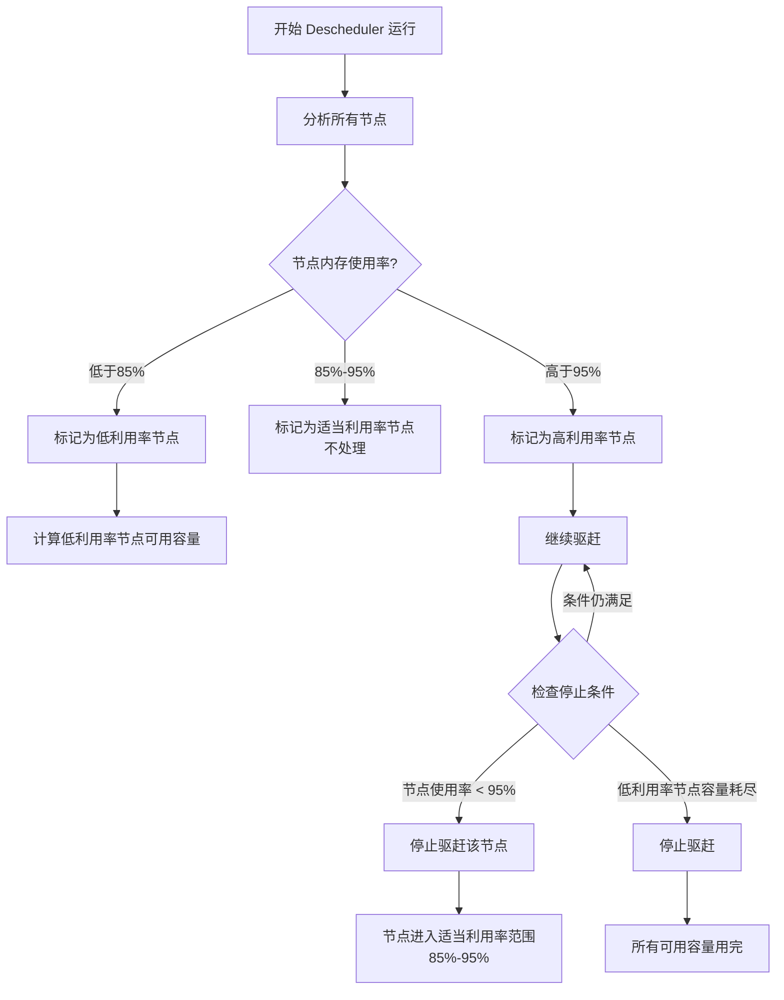

# LowNodeUtilization 插件配置分析

## 问题概述
用户提供了以下 DeschedulerPolicy 配置：
```yaml
apiVersion: "descheduler/v1alpha2"
kind: "DeschedulerPolicy"
profiles:
  - name: ProfileName
    pluginConfig:
    - name: "LowNodeUtilization"
      args:
        thresholds:
          "memory": 85
        targetThresholds:
          "memory": 95
        useMetrics: true
```

用户询问：**"我这样设置是不是，node节点到95%,就开始驱赶，驱赶到85%之后就不驱赶了"**

## 代码分析结果

### 1. 关键函数逻辑

#### 节点分类逻辑 (`classifyNodes` 函数)
- **低利用率节点**：所有资源使用率都低于 `thresholds` 值（85%）
- **高利用率节点**：任一资源使用率高于 `targetThresholds` 值（95%）
- **适当利用率节点**：介于两者之间（85%-95%）

#### 判断函数
- `isNodeWithLowUtilization`：检查节点是否**所有**资源都低于低阈值
- `isNodeAboveTargetUtilization`：检查节点是否**任一**资源高于高阈值

### 2. 驱赶停止条件 (`continueEvictionCond`)

在 `lownodeutilization.go` 第 171-183 行：
```go
continueEvictionCond := func(nodeInfo NodeInfo, totalAvailableUsage map[v1.ResourceName]*resource.Quantity) bool {
    if !isNodeAboveTargetUtilization(nodeInfo.NodeUsage, nodeInfo.thresholds.highResourceThreshold) {
        return false
    }
    for name := range totalAvailableUsage {
        if totalAvailableUsage[name].CmpInt64(0) < 1 {
            return false
        }
    }
    return true
}
```

**关键点**：停止条件有两个：
1. 节点不再高于目标阈值（即节点使用率降到 95% 以下）
2. 目标节点的可用容量耗尽

### 3. 驱赶流程图



## 回答用户问题

### **你的理解基本正确，但有重要细节需要澄清：**

1. **开始驱赶的条件**：✅ 正确
   - 当节点内存使用率 **超过 95%** 时，会被标记为高利用率节点
   - Descheduler 会从这些节点驱赶 Pod

2. **停止驱赶的条件**：⚠️ **不完全正确**
   - **不是**驱赶到 85% 就停止
   - **实际是**：当节点使用率降到 **95% 以下** 就停止驱赶该节点
   - 也就是说，驱赶会持续到节点使用率 **低于 95%**，而不是 85%

### 具体行为示例：
- 节点当前内存使用率：98% → **开始驱赶**
- 驱赶 Pod 后使用率降到：94% → **停止驱赶**
- 最终节点使用率：94%（在 85%-95% 范围内）
- 节点状态：变为"适当利用率节点"，不再被处理

## 配置的潜在问题

### 1. 驱赶可能过于激进
- 由于停止条件是 95%，节点可能被驱赶到 94% 就停止
- 这仍然高于你的期望值 85%
- 可能导致节点持续在较高使用率运行

### 2. 缺少其他资源配置
- 你只配置了 `memory`，但默认还有 `cpu` 和 `pods`
- 未配置的资源会使用默认值 100%
- 这意味着 CPU 和 Pod 数量不会影响节点分类

## 建议配置

### 方案1：如果你想精确控制到 85%
```yaml
args:
  thresholds:
    "cpu": 85
    "memory": 85
    "pods": 85
  targetThresholds:
    "cpu": 85  # 设置为与 thresholds 相同
    "memory": 85
    "pods": 85
  useMetrics: true
```
**效果**：节点超过 85% 就开始驱赶，降到 85% 以下停止

### 方案2：使用容差范围（推荐）
```yaml
args:
  thresholds:
    "cpu": 80
    "memory": 80
    "pods": 80
  targetThresholds:
    "cpu": 90
    "memory": 90
    "pods": 90
  useMetrics: true
```
**效果**：
- 80% 以下：低利用率节点（接收 Pod）
- 80%-90%：适当利用率（不处理）
- 90% 以上：高利用率节点（驱赶 Pod）
- 驱赶到 90% 以下停止

### 方案3：你的当前配置调整
```yaml
args:
  thresholds:
    "memory": 85
  targetThresholds:
    "memory": 85  # 改为与 thresholds 相同
  useMetrics: true
```
**效果**：内存超过 85% 开始驱赶，降到 85% 以下停止

## 最佳实践建议

1. **配置所有基础资源**：总是配置 `cpu`、`memory`、`pods` 三者
2. **设置合理的容差**：`targetThresholds` 比 `thresholds` 高 5-10%
3. **考虑使用 `useDeviationThresholds`**：基于集群平均使用率动态调整
4. **测试不同场景**：在生产环境使用前充分测试
5. **监控驱赶效果**：观察节点使用率分布是否达到预期

## 总结

你的当前配置：
- ✅ 节点超过 95% 内存使用率时会开始驱赶
- ❌ 不会驱赶到 85%，而是驱赶到 95% 以下就停止
- ⚠️ 最终节点可能停留在 94% 左右的使用率

如果你希望节点被驱赶到 85% 以下，需要将 `targetThresholds` 也设置为 85%，或者采用方案2的容差设计。